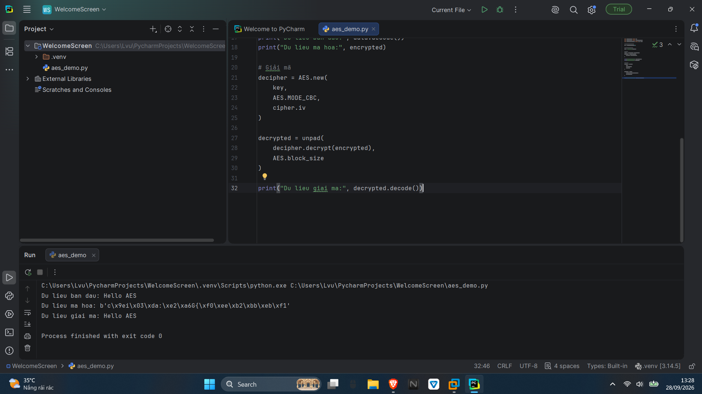

# TÌM HIỂU THUẬT TOÁN MÃ HÓA DES, AES VÀ RSA

## Thông tin sinh viên:
+ **Họ và tên:** Trần Lâm Vũ
+ **Lớp:** K59KMT.K01
+ **Mã số sinh viên:** K235510205299
+ **Trường:** Đại học Kỹ thuật Công nghiệp Thái Nguyên

## 1. Tìm hiểu thuật toán mã hóa DES, AES

### 1.1. Thuật toán DES

DES (Data Encryption Standard) là thuật toán **mã hóa đối xứng**, sử dụng cùng một khóa cho quá trình mã hóa và giải mã.

Một số đặc điểm:

- Kích thước khối dữ liệu: **64 bit**.
- Độ dài khóa hiệu dụng: **56 bit**.
- Thực hiện **16 vòng** xử lý.
- Hiện nay DES không còn an toàn do độ dài khóa ngắn.

Quy trình hoạt động cơ bản:

```text
Dữ liệu gốc
    ↓
Hoán vị ban đầu
    ↓
16 vòng xử lý
    ↓
Hoán vị cuối
    ↓
Bản mã
```

---

### 1.2. Thuật toán AES

AES (Advanced Encryption Standard) cũng là thuật toán **mã hóa đối xứng**, nhưng có độ an toàn cao và được sử dụng phổ biến hơn DES.

AES có các đặc điểm:

- Kích thước khối: **128 bit**.
- Hỗ trợ khóa: **128, 192 và 256 bit**.
- Số vòng tương ứng: **10, 12 và 14 vòng**.
- Có tốc độ xử lý nhanh, phù hợp để mã hóa lượng dữ liệu lớn.

Một vòng mã hóa AES gồm:

```text
SubBytes
    ↓
ShiftRows
    ↓
MixColumns
    ↓
AddRoundKey
```

Quá trình giải mã thực hiện các phép biến đổi ngược để khôi phục dữ liệu ban đầu.


---

### 1.3. Cài đặt AES bằng Python trên PyCharm

Trong bài này sử dụng **Python trên PyCharm** để xây dựng chương trình minh họa mã hóa và giải mã AES.

#### Bước 1: Tạo Project

Mở **PyCharm** → chọn:

```text
New Project
```

Đặt tên project, ví dụ:

```text
AES_RSA
```

Sau đó chọn **Create**.

#### Bước 2: Cài thư viện

Trong PyCharm, mở:

```text
View → Tool Windows → Terminal
```

Nhập:

```bash
pip install pycryptodome
```

Đợi đến khi xuất hiện thông báo cài đặt thành công.

#### Bước 3: Tạo chương trình AES

Chuột phải vào thư mục project:

```text
New → Python File
```

Đặt tên:

```text
aes_demo
```

Sau đó nhập code:

```python
from Crypto.Cipher import AES
from Crypto.Random import get_random_bytes
from Crypto.Util.Padding import pad, unpad

# Tạo khóa AES 128 bit
key = get_random_bytes(16)

# Dữ liệu cần mã hóa
data = "Hello AES".encode()

# Mã hóa
cipher = AES.new(key, AES.MODE_CBC)
encrypted = cipher.encrypt(
    pad(data, AES.block_size)
)

print("Du lieu ban dau:", data.decode())
print("Du lieu ma hoa:", encrypted)

# Giải mã
decipher = AES.new(
    key,
    AES.MODE_CBC,
    cipher.iv
)

decrypted = unpad(
    decipher.decrypt(encrypted),
    AES.block_size
)

print("Du lieu giai ma:", decrypted.decode())
```

#### Bước 4: Chạy chương trình

Trong PyCharm, nhấn chuột phải vào `aes_demo.py` → chọn:

```text
Run 'aes_demo'
```

Kết quả sẽ xuất hiện ở cửa sổ **Run** phía dưới:

```text
Du lieu ban dau: Hello AES
Du lieu ma hoa: b'...'
Du lieu giai ma: Hello AES
```

Phần dữ liệu mã hóa sẽ thay đổi do chương trình tạo khóa ngẫu nhiên.



---

## 2. Tìm hiểu thuật toán mã hóa bất đối xứng RSA

### 2.1. Thuật toán RSA

RSA (Rivest-Shamir-Adleman) là thuật toán **mã hóa bất đối xứng**.

Khác với AES và DES, RSA sử dụng một cặp khóa:

- **Public Key:** khóa công khai, có thể chia sẻ.
- **Private Key:** khóa bí mật, cần được bảo vệ.

Có thể biểu diễn:

```text
              RSA
               │
        ┌──────┴──────┐
        ↓             ↓
   Public Key     Private Key
   Công khai        Bí mật
```

---

### 2.2. Nguyên lý sinh cặp khóa RSA

Đầu tiên chọn hai số nguyên tố:

```text
p và q
```

Tính:

```text
n = p × q
φ(n) = (p - 1)(q - 1)
```

Tiếp theo chọn `e` sao cho phù hợp với `φ(n)` và tính `d` thỏa mãn:

```text
d × e ≡ 1 (mod φ(n))
```

Từ đó tạo được:

```text
Public Key  = (e, n)
Private Key = (d, n)
```

---

### 2.3. Mã hóa và giải mã RSA

Khi mã hóa, dữ liệu `M` được chuyển thành bản mã `C`:

```text
C = M^e mod n
```

Trong đó `e` thuộc **Public Key**.

Khi giải mã:

```text
M = C^d mod n
```

Trong đó `d` thuộc **Private Key**.

Quy trình:

```text
Dữ liệu gốc
     ↓
Public Key
     ↓
   Mã hóa
     ↓
   Bản mã
     ↓
Private Key
     ↓
  Giải mã
     ↓
Dữ liệu gốc
```

---

## 3. Các mô hình áp dụng thuật toán RSA

### 3.1. Xác thực người gửi

Trong ứng dụng chữ ký số, người gửi sử dụng **Private Key** để tạo chữ ký.

Người nhận sử dụng **Public Key của người gửi** để kiểm tra chữ ký.

```text
Người gửi
    ↓
Private Key
    ↓
Tạo chữ ký
    ↓
Gửi dữ liệu + chữ ký
    ↓
Người nhận
    ↓
Public Key người gửi
    ↓
Kiểm tra chữ ký
```

Điều này giúp người nhận kiểm tra chữ ký có tương ứng với khóa bí mật của người gửi hay không.

---

### 3.2. Xác thực người nhận

Khi cần bảo vệ thông tin gửi cho một người nhận cụ thể, **Public Key của người nhận** được sử dụng.

```text
Người gửi
    ↓
Public Key người nhận
    ↓
Mã hóa
    ↓
Dữ liệu mã hóa
    ↓
Người nhận
    ↓
Private Key
    ↓
Giải mã
```

Chỉ người có **Private Key tương ứng** mới có thể giải mã dữ liệu.

---

### 3.3. Xác thực cả người gửi và người nhận

Có thể kết hợp cả hai phương pháp:

- Người gửi dùng **Private Key** để ký.
- Sử dụng **Public Key của người nhận** để bảo vệ thông tin.
- Người nhận dùng **Private Key** để giải mã.
- Sau đó sử dụng **Public Key của người gửi** để kiểm tra chữ ký.

```text
NGƯỜI GỬI

Dữ liệu
   ↓
Private Key người gửi
   ↓
Ký dữ liệu
   ↓
Public Key người nhận
   ↓
Mã hóa
   ↓
Gửi đi
   ↓
────────────────────
   ↓
NGƯỜI NHẬN
   ↓
Private Key người nhận
   ↓
Giải mã
   ↓
Public Key người gửi
   ↓
Kiểm tra chữ ký
```

---

### 3.4. So sánh thời gian mã hóa/giải mã RSA và AES

| Tiêu chí | AES | RSA |
|---|---|---|
| Loại | Đối xứng | Bất đối xứng |
| Khóa | Một khóa bí mật | Public + Private |
| Mã hóa | Nhanh | Chậm hơn |
| Giải mã | Nhanh | Chậm hơn |
| Dữ liệu lớn | Phù hợp | Không phù hợp để mã hóa trực tiếp |
| Ứng dụng | Mã hóa dữ liệu | Trao đổi khóa, chữ ký số |

**AES nhanh hơn RSA** khi mã hóa và giải mã dữ liệu. Vì vậy RSA thường không được sử dụng để mã hóa trực tiếp lượng dữ liệu lớn.

---

### 3.5. Kết hợp RSA và AES

Có thể kết hợp RSA và AES để tận dụng ưu điểm của cả hai.

**AES** được sử dụng để mã hóa dữ liệu:

```text
Dữ liệu
   ↓
  AES
   ↓
Dữ liệu mã hóa
```

Khóa AES được bảo vệ bằng **RSA**:

```text
Khóa AES
   ↓
Public Key RSA
   ↓
Khóa AES được bảo vệ
```

Phía người nhận:

```text
Khóa AES được bảo vệ
          ↓
   Private Key RSA
          ↓
       Khóa AES
          ↓
Dữ liệu mã hóa
          ↓
         AES
          ↓
    Dữ liệu gốc
```

Như vậy:

- **AES:** mã hóa dữ liệu với tốc độ nhanh.
- **RSA:** hỗ trợ bảo vệ/trao đổi khóa AES.
- **AES + RSA:** tạo thành phương pháp mã hóa lai.

```text
              NGƯỜI GỬI

Dữ liệu ─────→ AES ─────→ Dữ liệu mã hóa
                ↑
             Khóa AES
                │
                ↓
         Public Key RSA
                ↓
        Khóa AES được bảo vệ

                ↓
              GỬI ĐI
                ↓

              NGƯỜI NHẬN

Khóa AES được bảo vệ
        ↓
Private Key RSA
        ↓
Khóa AES
        ↓
Dữ liệu mã hóa ─→ AES ─→ Dữ liệu gốc
```

Xuất thành `rsa-aes.png`.

---

## Kết luận

DES, AES và RSA là các thuật toán quan trọng trong bảo mật thông tin. **DES** hiện nay không còn phù hợp cho các hệ thống cần mức bảo mật cao do khóa ngắn. **AES** có tốc độ nhanh và phù hợp để mã hóa lượng dữ liệu lớn. **RSA** sử dụng cặp Public Key và Private Key, phù hợp cho trao đổi khóa và chữ ký số.

Việc kết hợp **RSA + AES** giúp tận dụng tốc độ xử lý của AES và khả năng bảo vệ, phân phối khóa của RSA.

---


